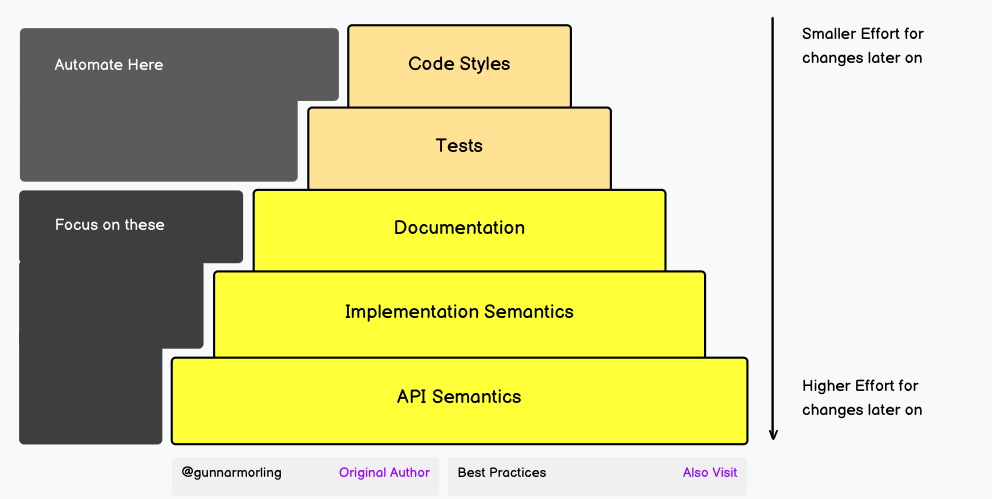

# 📘 Code Review Pyramid - roadmap.sh

> **Type:** Lecture Series

> **Status:** ✅ Complete
---

## 📝 Overview

Learn what to focus on when conducting a code review.

  

## 📚  Notes

### **Code Styles** 
- Is the project's formatting style applied?
- Does it adhere to the agreed-upon naming conventions?
- Is it DRY?
- Is the code sufficiently "readable" (method lengths, etc.)?

### **Tests**
- Are all tests passing?
- Are new features reasonably tested?
- Are corner cases tested?
- Is it using unit tests where possible, integration tests where necessary?
- Are there tests for NFRs, e.g. performance?

### **Documentation**
- Are the new features reasonably documented?
- Are all relevant types of documentation covered, such as README, API docs, user guide, reference docs, etc?
- Is the documentation understandable and free of significant typos and grammar mistakes?

### **Implementation Semantic**
- Does it satisfy the original requirements?
- Is it logically correct?
- Is there no unnecessary complexity?
- Is it robust (i.e., no concurrency issues, proper error handling, etc.)?
- Is it performant?
- Is it secure (i.e., no SQL injections, etc.)?
- Is it observable (i.e., metrics, logging, tracing, etc.)?
- Do newly added dependencies pull their weight? Is their license acceptable?

### **API Semantics**
- API as small as possible, as large as needed?
- Is there one way of doing one thing, not multiple ones?
- Is it consistent, does it follow the principle of least surprise?
- Clean split of API/internals without internals leaking into the API?
- Are there no breaking changes to user-facing parts (API classes, configuration, metrics, log formats, etc)?
- Is a new API generally useful and not overly specific to a single use case?

## 🔗 Resources

- [Lecture](https://roadmap.sh/code-review)
- [Course - Automating style enforcement](https://roadmap.sh/ai/course/code-review-automating-style-enforcement)
- [Course - Automating test](https://roadmap.sh/ai/course/code-review-automate-here-tests)