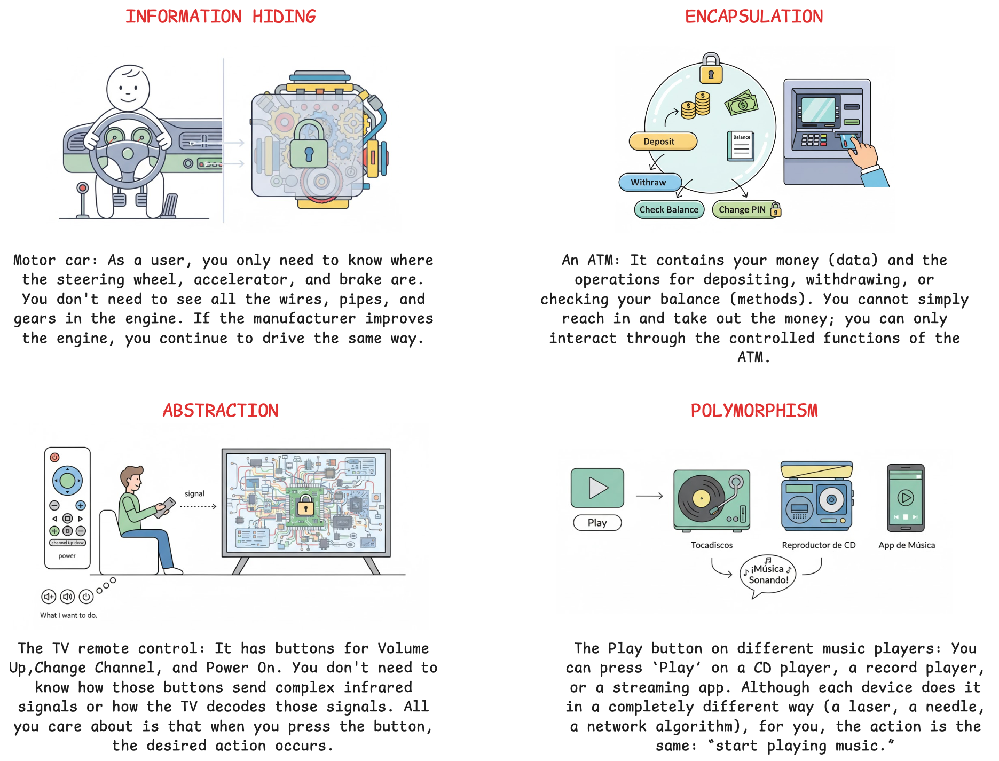
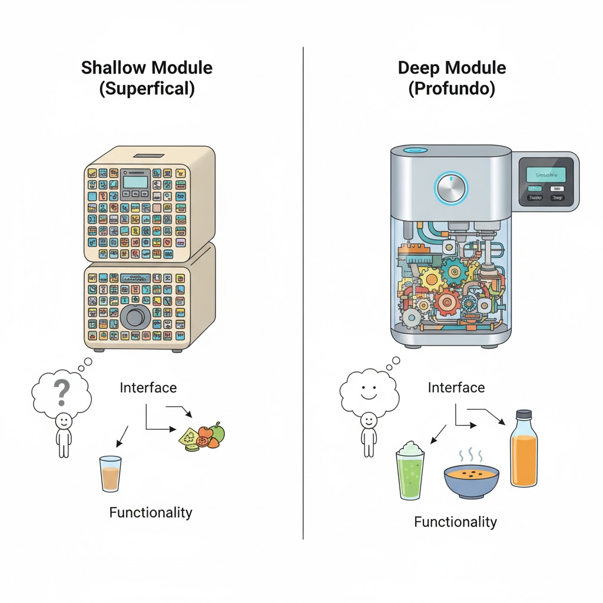
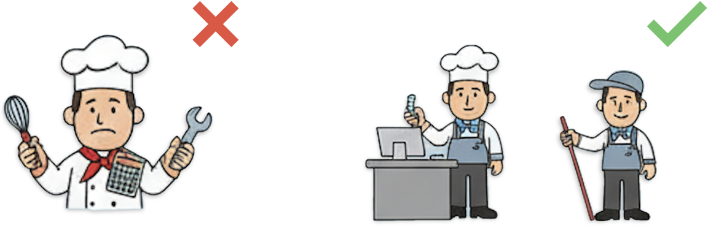
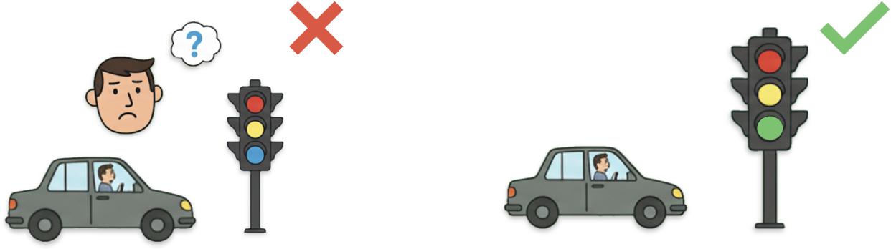
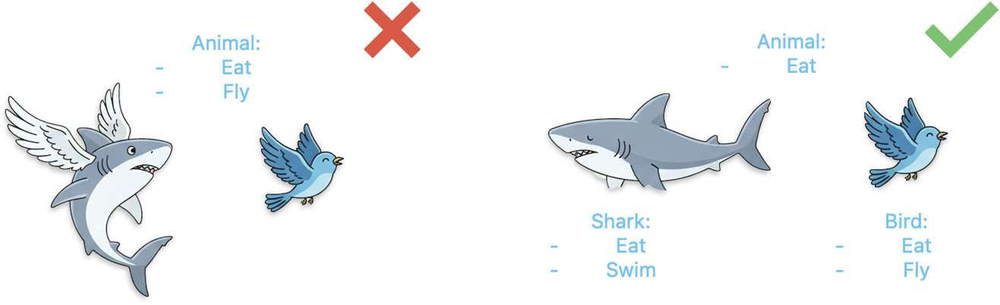
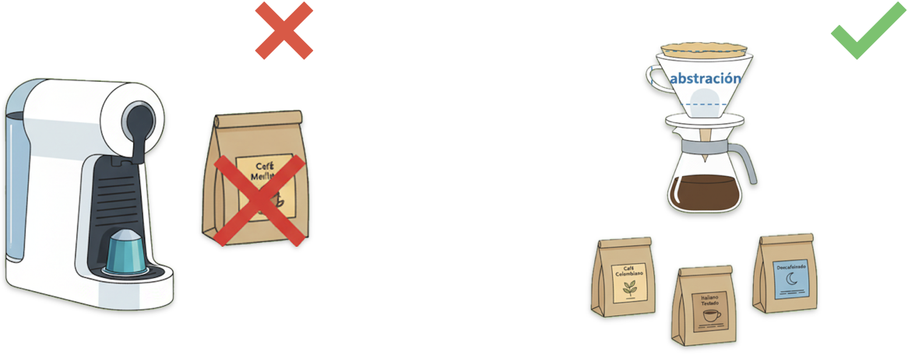

# 📘 Writing Clean Code: 20 Code Smells & How to Avoid Them - Packt

> **Type:** Course

> **Status:** ✅ Complete

---

## 📝 Overview

How to identify and refactor 20 common code smells that degrade software quality. You'll learn foundational SOLID principles, then tackle key issues through practical examples and refactoring techniques, you'll improve code readability, reduce technical debt, enhance encapsulation, and transform complex code into maintainable, scalable solutions.

## 📚 Notes

### <span style="color: red">Software design principles</span>

<table>
  <tr>
    <th>Principle</th>
    <th>Description</th>
    <th>Key Benefit</th>
    <th>Example</th>
  </tr>
  <tr>
    <td><b>🔐 Information Hiding</b></td>
    <td>Hiding the parts of code that are likely to change behind stable interfaces for modules</td>
    <td>Modules depend only on stable public interfaces of other modules, reducing coupling and ripple effects from changes</td>
    <td>Private fields/methods, internal implementation details hidden from external callers</td>
  </tr>
  <tr>
    <td><b>📦 Encapsulation</b></td>
    <td>Bundle data together with the methods that operate on that data, controlling access to information</td>
    <td>Prevents direct access to an object's internal components, maintaining data integrity and enabling validation</td>
    <td>Using getters/setters instead of public fields, class members with access modifiers</td>
  </tr>
  <tr>
    <td><b>🎭 Abstraction</b></td>
    <td>Model and expose only the important aspects of objects, hiding implementation details</td>
    <td>Identifies which abstractions can be composed to achieve desired functionality, simplifying complex systems</td>
    <td>Interfaces, abstract classes, high-level APIs that hide low-level operations</td>
  </tr>
  <tr>
    <td><b>🔄 Polymorphism</b></td>
    <td>Pattern where classes have different functionality while sharing a common, stable interface</td>
    <td>Allows treating objects of different classes as objects of a common superclass, enabling flexible and extensible code</td>
    <td>Method overriding, interface implementations, strategy pattern</td>
  </tr>
</table>

<p align="center">
  
</p>

<br>

### <span style="color: red">Deep Modules vs Shallow Modules</span>
```
    ❌ SHALLOW MODULE              ✅ DEEP MODULE
┌──────────────────────┐            ┌───────────┐
│  Complex Interface   │            │  Simple   │
│       (Large)        │            │ Interface │
├──────────────────────┤            ├───────────┤
│                      │            │           │
│ Little Functionality │            │   Large   │
│                      │            Functionality
└──────────────────────┘            │           │
                                    │           │
                                    └───────────┘
```
Deep modules have a large amount of functionality exposed through a relatively simple interface. They are easier to work with, maintain, and add more functionality than complexity to the code.

<p align="center">
  
</p>

<br>

### <span style="color: red">SOLID</span>

**Single Responsibility Principle (SRP)**: An entity should have only one reason to change. This makes the code easier to maintain, extend, and understand. It avoids high coupling between responsibilities.

<p align="center">
  
</p>

```python
# ❌ Multiple responsibilities
class OrderManager:
    def manage_inventory(self): pass
    def process_shipment(self): pass
    def generate_invoice(self): pass

# ✅ Single responsibility
class InventoryManager:
    def manage_inventory(self): pass

class ShipmentManager:
    def process_shipment(self): pass

class InvoiceManager:
    def generate_invoice(self): pass
```

**Open/Closed Principle (OCP)**: Entities should be open for extension but closed for modification. It allows you to add functionality by writing new code instead of modifying existing code.

<p align="center">
  
</p>

```python
# ❌ Every time we need to add a new type of storage, we must modify the existing DataStore class
class DataStore:
    def read_from_file(self, path): pass
    def save_to_file(self, path): pass
    def read_from_http(self, path): pass  # Modifying class
    def save_to_http(self, path): pass    # Modifying class

# ✅ Extension through inheritance/interfaces
class IDataStore:
    def read(self, path): pass
    def save(self, path): pass

class FileStore(IDataStore):
    def read(self, path): pass
    def save(self, path): pass

class HttpStore(IDataStore):
    def read(self, path): pass
    def save(self, path): pass
```

**Liskov Substitution Principle (LSP)**: Objects of a subtype must be replaceable by objects of their supertype without breaking the application.

<p align="center">
  
</p>

```python
# ❌ Subtype contradicts the behavior of the supertype
class Animal:
    def walk(self): pass

class Bird(Animal):
    def walk(self):
        raise Error("Birds don't walk!")  # ❌

# ✅ Appropriate abstraction
class Animal:
    def move(self): pass

class Bird(Animal):
    def move(self):
        self.fly()

class Dog(Animal):
    def move(self):
        self.walk()
```

**Interface Segregation Principle (ISP)**: No code should depend on methods it does not use. It is recommended to divide large interfaces into smaller ones so that classes implement only the methods they really need.

<p align="center">
  
</p>

```python
# ❌ Large interface that forces empty implementations
class IWorker:
    def work(self): pass
    def eat(self): pass
    def sleep(self): pass

class Robot(IWorker):
    def work(self): pass
    def eat(self): pass      # ❌ No need it
    def sleep(self): pass    # ❌ No need it

# ✅ Small, specific interfaces
class IWorkable:
    def work(self): pass

class IFeedable:
    def eat(self): pass

class Human(IWorkable, IFeedable):
    def work(self): pass
    def eat(self): pass

class Robot(IWorkable):
    def work(self): pass
```

**Dependency Inversion Principle (DIP)**: High-level modules should not depend on low-level modules; both should depend on abstractions. Allows greater flexibility and ease in changing implementations without affecting high-level modules.

<p align="center">
  
</p>

```python
# ❌ Direct responsibility for concrete implementation
class DataDisplay:
    def __init__(self):
        self.file_store = FileStore()  # ❌
    
    def display(self):
        data = self.file_store.read_from_file('data.txt')

# ✅ Abstraction dependency
class DataDisplay:
    def __init__(self, data_store: IDataStore):
        self.data_store = data_store
    
    def display(self):
        data = self.data_store.read('data.txt')

# You can inject FileStore or HttpStore.
display = DataDisplay(FileStore())
display = DataDisplay(HttpStore())
```

<br>

### <span style="color: red">20 Code Smells</span>

**1. Loops**

Why it's bad:
- Loops obscure logic by requiring explicit coding of iteration logic
- They make code more verbose than necessary

How to fix it:
- Use pipeline structures (.map(), .filter(), .reduce()) instead of hard-coded loops
- Pipeline structures abstract iteration logic and allow you to focus on how elements are filtered, mapped, or reduced

```ts
// ❌
let doubled = [];
for (let i = 0; i < numbers.length; i++) {
    doubled.push(numbers[i] * 2);
}

// ✅
const doubled = numbers.map(n => n * 2);
```

**2. Uninformative Comments**

Why it's bad:

- Non-informative comments make code more polluted and difficult to read.
- They are often used to try to clarify unclear code resulting from other code smells.

How to fix it:

- First, make sure other smells are already resolved.
- Once the code is clean, remove any comments that duplicate information in the code.
- Add comments to capture any thought processes that are not clear in the code.

```ts
// ❌
// Increase counter in one
const counter = counter + 1

// ✅
// Apply a 15% discount only for premium customers with more than 5 purchases.
if( customer.is_premium && customer.purchases > 5 ) {
  price *= 0.15
}
```

**3. Shotgun Surgery**

Why it's bad:

- It reduces code maintainability by requiring multiple changes for a single change.
- It's easy to forget to change one part of the code, introducing bugs.
- It's often the result of poor encapsulation or modularity.

How to fix it:

- Add layers of abstraction between components to reduce coupling.
- Prevent information leakage by encapsulating knowledge of internal variables in their respective classes.

```python
# ❌
# file1.py
date_str = f"{year}-{month}-{day}"
# file2.py
date_str = f"{year}-{month}-{day}"
# file3.py
date_str = f"{year}-{month}-{day}"

# ✅
class DateFormatter:
    @staticmethod
    def format(year, month, day):
        return f"{year}-{month}-{day}"
```

**4. Knowledge Duplication**

Why it's bad:

- When duplicate knowledge changes, we need to search through all the code to update each duplication.
- Different instances of duplicate knowledge may be doing different things when they are expected to do the same thing.

How to fix it:

- Extract duplicate knowledge into helper functions or classes.
- Use the helper functions throughout the code, but be sure not to overload them.
- Avoid extracting similar code that represents different knowledge.

```ts
// ❌
function createUser(email) {
    if (!email.includes('@')) throw new Error('Invalid email');
}

function updateUser(email) {
    if (!email.includes('@')) throw new Error('Invalid email');
}

// ✅ 
function validateEmail(email) {
    if (!email.includes('@')) throw new Error('Invalid email');
}

function createUser(email) {
    validateEmail(email);
}

function updateUser(email) {
    validateEmail(email);
}
```

**5. Alternative Classes with Different Interfaces**

Why it's bad:

- It violates the principle of Abstraction.
- It easily leads to more code than necessary and duplication of knowledge.

How to fix it:

- Standardize abstractions and their respective interfaces.
- If classes are appropriate subtypes, consider placing functionality in a superclass.
- Favor composition over inheritance for sharing behavior.

```ts
# ❌
class FileReader {
    String loadFromFile(String path) { }
}

class DatabaseReader {
    String fetchFromDB(String query) { }
}

# ✅
interface IDataReader {
    String read(String source);
}

class FileReader implements IDataReader {
    String read(String path) { }
}

class DatabaseReader implements IDataReader {
    String read(String query) { }
}
```

**6. Unclear/Confusing Names**

Why it's bad:

- The code becomes unclear and confusing to understand.
- It makes it more difficult for others to work with the code.

How to fix it:

- Rename the entity so that it is meaningful and represents what it does.
- If the name becomes too long, it may be a sign that the entity is doing or storing too much information.
- Avoid using names that reflect the type of variable.

```python
# ❌
c = "John"
d = 25

# ✅
customer_name = "John"
discount_percentage = 25
```

**7. Primitive Obsession**

Why it's bad:

- Leads to poor encapsulation
- Can easily lead to duplication of knowledge when dealing with validation and other operations

How to fix it:

- Model domain behavior and non-primitive knowledge through custom types
- Be careful not to overfit types to their use cases (“type explosion”)
- Encapsulate validation logic in custom type classes

```python
# ❌
phone_number = "555-1234"  # Only a string
email = "user@example.com"  # Only a string
price = 19.99  # Only a number

# ✅
class PhoneNumber:
    def __init__(self, number):
        if not self._is_valid(number):
            raise ValueError("Invalid phone number")
        self.number = number
    
    def _is_valid(self, number):
        return len(number) == 10

class Money:
    def __init__(self, amount, currency):
        self.amount = amount
        self.currency = currency
    
    def add(self, other):
        if self.currency != other.currency:
            raise ValueError("Currency mismatch")
        return Money(self.amount + other.amount, self.currency)
```

**8. Multitaskers / Long Functions**

Why it's bad:

- Multitaskers are harder to understand and change.
- Pieces of knowledge within multitaskers cannot be reused unless they are extracted.
- Longer functions are naturally more complex to work with.

How to fix it:

- Identify the core purpose of a function/class
- Everything that does not directly belong to that core purpose should be extracted to other entities

```ts
// ❌
function processOrder(order) {
    // Validate inventory
    if (inventory[order.item] < order.quantity) {
        throw new Error('Out of stock');
    }
    
    // Calculate price
    let price = order.quantity * prices[order.item];
    if (customer.isPremium) price *= 0.9;
    
    // Process payment
    payment.process(customer.card, price);
    
    // Update inventory
    inventory[order.item] -= order.quantity;
    
    // Send email
    email.send(customer.email, 'Order confirmed');
}

// ✅
function processOrder(order) {
    validateInventory(order);
    const price = calculatePrice(order);
    processPayment(customer, price);
    updateInventory(order);
    sendConfirmationEmail(customer);
}
```

**9. Divergent Change**

Why it's bad:

- When an object or class needs to change for more than one reason, it indicates a violation of the Single Responsibility Principle.

How to fix it:

- Divide the object or class into multiple entities, each with its own responsibility.
- Call each of the resulting entities when necessary.

```python
# ❌
class Product:
    def calculate_discount(self): pass  # Changes for discounts
    def calculate_tax(self): pass       # Changes for taxes rules
    def format_display(self): pass      # Changes for ui format

# ✅
class DiscountCalculator:
    def calculate(self, product): pass

class TaxCalculator:
    def calculate(self, product): pass

class ProductFormatter:
    def format(self, product): pass
```

**10. Large Interfaces**

Why it's bad:

- Large interfaces are a sign that modules are leaking too much information about their internal structures.
- It introduces coupling between different parts of the code.

How to fix it:

- Avoid exposing low-level details to the outside world.
- Split interfaces that have more than one responsibility.
- When defining the boundaries of an interface, focus on behavior and domain knowledge.

```ts
// ❌
interface IUserService {
    createUser(): void;
    updateUser(): void;
    deleteUser(): void;
    authenticateUser(): void;
    changePassword(): void;
    sendEmail(): void;
    logActivity(): void;
    generateReport(): void;
}

// ✅
interface IUserManagement {
    createUser(): void;
    updateUser(): void;
    deleteUser(): void;
}

interface IAuthentication {
    authenticateUser(): void;
    changePassword(): void;
}

interface INotification {
    sendEmail(): void;
}
```

**11. Long Parameter List**

Why it's bad:

- Long lists of parameters are harder to maintain.
- If we pass parameters in the wrong order, we can break the function.

How to fix it:

- Replace data parameters with a single data object.
- If information can be obtained from another parameter, remove the additional parameter
- Avoid passing flag parameters

```python
# ❌
def create_user(name, email, age, address, city, country, phone, occupation):
    pass

# ✅
class UserData:
    def __init__(self, name, email, age, address, phone):
        self.name = name
        self.email = email
        self.age = age
        self.address = address
        self.phone = phone

def create_user(user_data: UserData):
    pass
```

**12. Mutable Data**

Why it's bad:

- Updating data used by other parts of the code can introduce bugs and side effects.
- Mutable data creates hidden dependencies and coupling.

How to fix it:

- Encapsulate data used by multiple methods with appropriate setter and getter methods.
- When modifying an object, choose to return a copy of the object with the changes.
- Avoid modifying function parameters as much as possible.

```ts
// ❌
function applyDiscount(product, discount) {
    product.price = product.price * (1 - discount);  // Mute the object
    return product;
}

// ✅
function applyDiscount(product, discount) {
    return {
        ...product,
        price: product.price * (1 - discount)
    };
}
```

**13. Middle Man**

Why it's bad:

- This pattern adds virtually no value to the code.
- It introduces additional sources of coupling.
- Encapsulation is highly encouraged, but when methods become too superficial, it's a sign of poor structure.

How to fix it:

- If there is no additional logic, remove as many intermediaries as possible.
- Combine methods and simplify the class interface.

```ts
// ❌
class Department {
    private Manager manager;
    
    public String getManagerName() {
        return manager.getName();  // Only return the call
    }
    
    public String getManagerPhone() {
        return manager.getPhone();  // Only return the call
    }
}

// ✅
class Department {
    private Manager manager;
    
    public Manager getManager() {
        return manager;  // Allow direct access
    }
}
```

**14. Data Clumps**

Why it's bad:

- Typically reflect the internal data structure of objects

How to fix it:

- Move related fields to an object or class
- Refactor method signatures to receive the entire object

```python
# ❌
def create_address(street, city, zip_code, country): pass
def validate_address(street, city, zip_code, country): pass
def format_address(street, city, zip_code, country): pass

# ✅
class Address:
    def __init__(self, street, city, zip_code, country):
        self.street = street
        self.city = city
        self.zip_code = zip_code
        self.country = country
    
    def validate(self): pass
    def format(self): pass

def create_address(address: Address): pass
```

**15. Repeated Switches**

Why it's bad:

- Duplicates knowledge in the code base
- It's very easy to forget to add/update conditional clauses when the logic changes

How to fix it:

- Encapsulate conditional logic
- Use polymorphism when relevant and applicable

```ts
// ❌
function getPrice(type) {
    switch(type) {
        case 'basic': return 10;
        case 'premium': return 20;
        case 'enterprise': return 50;
    }
}

function getFeatures(type) {
    switch(type) {  // same switch
        case 'basic': return ['feature1'];
        case 'premium': return ['feature1', 'feature2'];
        case 'enterprise': return ['feature1', 'feature2', 'feature3'];
    }
}

// ✅
class Plan {
    getPrice() {}
    getFeatures() {}
}

class BasicPlan extends Plan {
    getPrice() { return 10; }
    getFeatures() { return ['feature1']; }
}

class PremiumPlan extends Plan {
    getPrice() { return 20; }
    getFeatures() { return ['feature1', 'feature2']; }
}
```

**16. Refused Bequest**

Why it's bad:

- It indicates an incorrect inheritance hierarchy.
- We put too much information in superclasses.

How to fix it:

- Remove unnecessary methods from the superclass.
- Use composition to inject behavior instead of relying too much on inheritance.
- If there is interface misalignment, revisit the super-subclass relationship

```python
# ❌
class Bird:
    def fly(self): pass
    def walk(self): pass

class Penguin(Bird):
    def fly(self):
        raise NotImplementedError("Penguins can't fly!")

# ✅
class IWalkable:
    def walk(self): pass

class IFlyable:
    def fly(self): pass

class Penguin(IWalkable):
    def walk(self): pass

class Eagle(IWalkable, IFlyable):
    def walk(self): pass
    def fly(self): pass
```

**17. Speculative Generality**

Why it's bad:

- It leads to code that is more complex than necessary.
- Unnecessary functionality is wasted time and resources.

How to fix it:

- Remove unused code.
- Keep the code structure simple: avoid over-engineering.

```ts
// ❌
interface IPayment {
    void processCreditCard();
    void processPayPal();
    void processCrypto();      // Not used yet
    void processApplePay();    // Not used yet
    void processGooglePay();   // Not used yet
}

// ✅
interface IPayment {
    void processCreditCard();
    void processPayPal();
}
```

**18. Unnecessary Exceptions**

Why it's bad:

- Exceptions interrupt the normal flow of the program.
- Boilerplate code for handling exceptions can be painfully long and complicated.

How to fix it:

- Add default behaviors or values
- Mask exceptions by handling them as close as possible to where they are thrown
- Add aggregate exception handling by handling as many exceptions as possible in a single piece of code

```python
# ❌
def get_user(user_id):
    user = database.find(user_id)
    if user is None:
        raise UserNotFoundException(f"User {user_id} not found")
    return user

# ✅
def get_user(user_id):
    user = database.find(user_id)
    return user if user else User.guest()  # Default user
```

**19. Feature Envy**

Why it's bad:

- Low cohesion leads to high coupling between modules.
- Low cohesion also indicates that module responsibilities are not well defined.
- It can be easy to forget to call a certain method or call methods in the wrong order.

How to fix it:

- Move the function that continuously interacts with another module to that module
- Consider improving the system design by better establishing boundaries between domains
- Put things that change together

```ts
// ❌
class ShoppingCart {
    items: Item[] = [];

    calculateTotal(): number {
        let total = 0;
        for (const item of this.items) {
            total += item.price * item.quantity;
            total -= item.discount;   // Access a lot to Item
            total += item.tax;
        }
        return total;
    }
}

// ✅
class Item {
    constructor(
        public price: number,
        public quantity: number,
        public discount: number,
        public tax: number
    ) {}

    getTotalPrice(): number {
        return (this.price * this.quantity) - this.discount + this.tax;
    }
}

class ShoppingCart {
    items: Item[] = [];

    calculateTotal(): number {
        return this.items.reduce((total, item) => total + item.getTotalPrice(), 0);
    }
}

```

**20. Shallow Modules**

Why it's bad:

- Shallow modules have a large surface area and little added functionality.
- More surface area means more places for coupling and less information hiding.

How to fix it:

- Aim for deep modules: complex and meaningful features exposed through simple interfaces.

```ts
// ❌
class UserValidator {
    validateEmail(email) { return email.includes('@'); }
    validateName(name) { return name.length > 0; }
    validateAge(age) { return age > 0; }
    validatePhone(phone) { return phone.length === 10; }
    validateAddress(address) { return address.length > 0; }
}

// ✅
class UserValidator {
    validate(user) {
        const errors = [];
        this._validateEmail(user.email, errors);
        this._validateCredentials(user, errors);
        this._validateProfile(user, errors);
        this._validateBusinessRules(user, errors);
        return { isValid: errors.length === 0, errors };
    }
}
```


## 🔗 Resources

- [Course](https://www.coursera.org/learn/packt-writing-clean-code-20-code-smells-how-to-avoid-them-g2oer#about)
- [Repository](https://github.com/PacktPublishing/Writing-Clean-Code---20-Common-Code-Smells-and-How-to-Avoid-Them)
- [Material course](https://drive.google.com/file/d/15syGT5RN49rf11FAqybvtzzoIteemFzW/view?usp=sharing)
